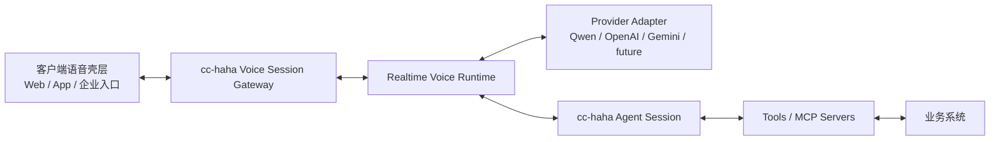

# 实时语音 Runtime 设计稿

## 目标

在 `cc-haha` 内部建设一层 **provider-neutral 的实时语音助手 Runtime**，让它可以服务浏览器、移动 App、企业 IM、企业语音入口等多种终端。

首版目标不是“支持语音输入”，而是：

- 支持自然双向语音对话
- 支持实时语音输出
- 支持打断
- 支持工具调用
- 支持高风险操作确认

这是一项 **通用平台能力**，不是 `Fire` 的一次性定制功能。`Fire` 可以是第一批接入方，但设计不能和 `Fire` 绑定死。

## 目标体验

我们要做的是接近豆包这类产品的语音体验，而不是命令行里的语音听写：

- 用户直接开口说话，不需要按住录音键
- 助手以流式语音回复，而不只是文本
- 助手说话时，用户可以随时打断
- 对话过程中可以调用工具或 MCP
- 只读查询可以自然完成
- 写操作或高风险操作需要明确确认
- 同一套底层能力可以复用到网页、App、企业入口

当前仓库里的 `/voice` 能力只能视为参考资产。它更接近 “push-to-talk + 语音转文字” 的听写模式，而不是我们这次要做的实时双向语音助手。

## 非目标

- 不把 `Fire` 作为语音 Runtime 的硬依赖
- 不把业务工具直接暴露给浏览器前端
- 不要求所有 provider 底层 API 完全一致
- 首版不从零自研 ASR、VAD、LLM、TTS
- 不替换现有文字聊天能力

## 总体架构

在 `cc-haha` server 里新增一层 `Realtime Voice Runtime`，与现有 chat/session 服务并存。它负责连接实时语音 provider，并桥接到现有的 agent、tool、MCP、permission 体系。



### 1. 客户端语音壳层

客户端只负责设备与交互层：

- 麦克风采集
- 扬声器播放
- 本地静音、停止
- 打断手势或按钮
- 语音状态 UI
- 高风险操作确认弹窗

客户端不负责真正的工具执行。它只负责发音频、收事件、播音频、渲染状态。

### 2. Voice Session Gateway

`cc-haha` 对外提供新的实时语音入口，管理 voice session 生命周期。

推荐传输方式：

- 浏览器优先 `WebRTC`
- App 或非浏览器客户端可支持 `WebRTC` 或 `WebSocket`
- 对不方便上 WebRTC 的场景提供 WebSocket 音频流兜底

Gateway 负责：

- 鉴权
- 创建 voice session
- 绑定 agent session
- 在客户端、provider adapter、agent bridge 之间路由事件

### 3. Provider Adapter 层

所有 provider 特有逻辑都收敛在 adapter 里，对上暴露统一接口。

首批 provider 策略建议改为：

- `qwenOmniRealtimeAdapter`：首个正式接入对象
- `openaiRealtimeAdapter` 或 `geminiLiveAdapter`：第二 provider，用来验证抽象是否成立
- `seeduplexAdapter`：暂不纳入首版实现，作为未来观察项

原因如下：

- `Qwen-Omni-Realtime` 目前已有公开 API、WebSocket 协议、SDK 和鉴权方式，适合工程落地
- `Seeduplex` 官方已明确大规模落地在豆包 App，但目前公开资料里没有看到稳定、正式、面向开发者的开放 API 文档和接入入口，不能作为首版工程主线

Runtime 需要定义一组标准能力，让 provider 上报自己支持什么：

- `audioInput`
- `audioOutput`
- `transcription`
- `serverVad`
- `semanticVad`
- `bargeIn`
- `toolCalling`
- `textOutput`
- `voiceSelection`

### 4. Agent Bridge

语音 Runtime 必须尽量复用现有 `cc-haha` 的 agent/session/tooling 体系。

Bridge 负责：

- 把 voice session 绑定到 agent session
- 注入转写结果和上下文
- 把工具调用路由到现有 tool/MCP 执行链路
- 把 tool 结果回传给 provider 或 agent loop
- 在工具执行较慢时生成适合播报的进度话术
- 协调权限确认

语音只是新的交互层，不应该在 `cc-haha` 内部再造一套平行 agent 系统。

## 统一语音事件协议

外部客户端应该只认识 `cc-haha` 的统一协议，不应该直接依赖某个 provider 的原生消息格式。

### Client -> Server

```ts
type VoiceClientEvent =
  | { type: 'session.start'; sessionId?: string; provider?: string; voice?: string }
  | { type: 'audio.input.append'; audio: string; format: AudioFormat }
  | { type: 'audio.input.commit' }
  | { type: 'audio.input.clear' }
  | { type: 'assistant.interrupt' }
  | { type: 'permission.approve'; requestId: string; input?: unknown }
  | { type: 'permission.reject'; requestId: string; reason?: string }
  | { type: 'session.close' }
```

### Server -> Client

```ts
type VoiceServerEvent =
  | { type: 'session.started'; voiceSessionId: string; agentSessionId: string }
  | { type: 'session.state'; state: VoiceSessionState }
  | { type: 'transcript.delta'; text: string; speaker: 'user' | 'assistant' }
  | { type: 'transcript.final'; text: string; speaker: 'user' | 'assistant' }
  | { type: 'assistant.audio.chunk'; audio: string; format: AudioFormat }
  | { type: 'assistant.audio.stop' }
  | { type: 'assistant.text.delta'; text: string }
  | { type: 'tool.call.started'; callId: string; name: string; summary?: string }
  | { type: 'tool.call.completed'; callId: string; resultSummary?: string }
  | { type: 'permission.request'; requestId: string; toolName: string; reason: string; input: unknown }
  | { type: 'permission.resolved'; requestId: string; approved: boolean }
  | { type: 'session.error'; code: string; message: string; recoverable: boolean }
```

### 会话状态

```ts
type VoiceSessionState =
  | 'connecting'
  | 'listening'
  | 'thinking'
  | 'speaking'
  | 'tool_running'
  | 'awaiting_permission'
  | 'interrupted'
  | 'closed'
```

## 工具与权限模型

工具执行必须继续由 `cc-haha` 控制，不能交给前端。

只读工具：

- 可以按 session 策略自动放行
- 仍然必须审计
- 执行较慢时要能播报简短进度

写操作或高风险工具：

- 必须触发 `permission.request`
- 在用户确认前暂停或弱化语音播报
- 收到 `permission.approve` 之后才真正执行
- 支持 `permission.reject` 并自然回到对话

推荐策略结构：

```ts
type VoiceToolPolicy = {
  autoApproveReadOnly: boolean
  requireConfirmationForWrite: boolean
  allowedToolPrefixes: string[]
  deniedToolPrefixes: string[]
}
```

MCP 集成继续复用现有的 session 级动态 MCP 注入能力。语音 session 可以绑定到已经挂好 MCP servers 的 agent session 上。

## 打断与轮次控制

打断是首版必须能力，不是增强项。

当用户在助手播报时开始说话：

1. 客户端发送 `assistant.interrupt`
2. Runtime 立即停止当前音频输出
3. Provider adapter 尝试取消或截断当前生成
4. Agent bridge 把当前 assistant turn 标记为 interrupted
5. Runtime 回到 `listening`

如果 provider 原生支持 full-duplex 或 barge-in，就优先使用。  
如果 provider 只支持近似实时，也要通过本地停止播报 + 取消当前生成尽量模拟打断体验。

轮次判断优先级建议：

1. provider 原生 realtime VAD / semantic VAD
2. `cc-haha` server 侧补充策略
3. 客户端 VAD 仅作为兜底或优化，不作为唯一判断边界

## 音频格式

协议需要允许多种音频格式，但首版应该限制在少量可靠格式内。

推荐首版：

- 输入：`pcm16`
- 输出：使用 provider 原生流式音频
- 浏览器播放：`WebAudio` 或 `WebRTC remote track`

provider-specific 的编码转换留在 adapter 内部，客户端不需要直接知道每家 provider 的底层细节。

## 上下文模型

语音 session 需要一个简洁但可信的上下文模型。

建议注入：

- 用户身份
- 租户 / 工作空间
- 当前产品入口
- 当前页面或对象上下文
- 允许使用的工具
- 风险确认策略

这里要强调：  
Prompt 上下文只能改善行为，**不能承担授权边界**。  
真正的权限判断必须在服务端或 MCP 侧完成。

## 安全与审计

必须具备：

- 每个 voice session 都要鉴权
- 每个 voice session 都绑定到明确用户
- provider API key 只放服务端
- 业务工具凭证只放服务端
- 工具调用、确认、拒绝、provider 错误都需要审计
- 尽量避免把无关敏感业务数据发给外部语音 provider
- 支持在发往 provider 前做上下文脱敏

推荐补一个 provider policy：

```ts
type VoiceProviderPolicy = {
  allowedProviders: string[]
  allowAudioRetention: boolean
  redactContextBeforeProvider: boolean
  preferredRegion?: string
}
```

## Voice Provider 配置

实时语音 provider 必须独立于现有文本 LLM provider 管理。

现有 `cc-haha` 已经有一套普通 LLM provider 配置，用于文本 agent 主循环。它会管理 `ANTHROPIC_BASE_URL`、`ANTHROPIC_API_KEY`、`ANTHROPIC_AUTH_TOKEN`、`ANTHROPIC_MODEL` 等配置。

实时语音 provider 不能直接复用这套 active text provider 概念。原因是：

- 语音 provider 使用的协议可能是 WebSocket 或 WebRTC
- 语音模型和文本模型的 model mapping 不一样
- 同一个 `sk-xxx` 前缀可能来自阿里云、OpenAI 或其他平台
- 用户可能希望文本 agent 用 DeepSeek，但语音 Runtime 用 Qwen-Omni-Realtime

因此建议新增独立配置域：

- `VoiceProviderService`
- `voice-providers.json`
- `/api/voice/providers`

API key 的 provider 类型不能通过 key 前缀判断。阿里云的 key 也可能是 `sk-xxx` 开头，所以应该由显式配置决定：

```ts
type VoiceProviderType =
  | 'qwen_omni_realtime'
  | 'openai_realtime'
  | 'gemini_live'
  | 'custom_realtime'

type ApiKeyRef =
  | { source: 'env'; name: string }
  | { source: 'stored'; value: string }
  | { source: 'text_provider'; providerId: string }
```

首版建议支持：

- `env`
- `stored`

`text_provider` 复用现有 LLM key 的能力可以作为第二阶段，必须由用户显式选择，不能默认复用。

详见：
[realtime-voice-provider-config.md](./realtime-voice-provider-config.md)

## `cc-haha` 侧建议新增的模块

- `src/server/voice/protocol.ts`
  定义语音事件 schema、状态、音频格式与校验

- `src/server/voice/voiceSessionService.ts`
  管理 voice session 生命周期、agent session 绑定、provider 选择、状态流转、清理

- `src/server/voice/voiceGateway.ts`
  处理实时客户端连接与事件路由

- `src/server/voice/providers/types.ts`
  定义 provider adapter 接口与能力模型

- `src/server/voice/providers/qwenOmniRealtimeAdapter.ts`
  实现 Qwen-Omni-Realtime adapter

- `src/server/voice/providers/openaiRealtimeAdapter.ts`
  或 `src/server/voice/providers/geminiLiveAdapter.ts`
  作为第二 provider adapter

- `src/server/services/voiceAgentBridge.ts`
  连接 provider 事件与现有 agent、tool、MCP、permission

- `src/server/services/voicePermissionService.ts`
  处理语音场景的权限确认策略

客户端侧建议组件：

- `VoiceClient`
- `VoiceRecorder`
- `VoicePlayer`
- `VoiceStateIndicator`
- `VoicePermissionDialog`

## Provider Adapter 接口

首版保持接口窄一些，先保证工程清晰。

```ts
export type RealtimeVoiceProviderAdapter = {
  readonly name: string
  readonly capabilities: VoiceProviderCapabilities
  connect(options: ProviderConnectOptions): Promise<ProviderConnection>
}

export type ProviderConnection = {
  sendAudio(chunk: AudioChunk): Promise<void>
  commitAudio(): Promise<void>
  interrupt(): Promise<void>
  sendToolResult(result: VoiceToolResult): Promise<void>
  updateSession(options: ProviderSessionUpdate): Promise<void>
  close(): Promise<void>
}
```

Provider 的事件回调通过 `ProviderConnectOptions` 注入，避免 adapter 直接依赖 gateway 代码。

## Provider 选型建议

### Qwen-Omni-Realtime

可以，**而且适合作为首版正式接入对象**。

原因：

- 官方已有公开实时文档
- 官方明确支持 WebSocket
- 官方明确支持实时音频输入与音频输出
- 官方文档里有 `session.update`、`tools`、`turn_detection`、`voice` 等能力
- 官方鉴权方式清晰，使用 `DASHSCOPE_API_KEY`

工程结论：

- `Qwen-Omni-Realtime` 适合进入设计稿主线
- 首版可以把它作为第一 provider adapter

补充一个关键校准：

对我们这次要做的实时语音 Runtime，更合适的主路径不是“多模态交互应用 + `workspace_id/app_id`”，而是 **直接使用百炼的 Realtime 模型 WebSocket API**。

按当前官方文档，`qwen3.5-omni-plus-realtime` 和 `qwen3.5-omni-flash-realtime` 都是直接的 Realtime 模型能力，工程上应理解为：

- 使用 WebSocket 连接
- 输入支持文本、音频、图片
- 输出支持文本、音频
- 支持 `Function Calling`
- 支持联网搜索
- 但 **联网搜索与工具调用不能同时开启**

这意味着首版 Phase 2 的真实门槛应改成：

- `DASHSCOPE_API_KEY`
- 正确的 Realtime WebSocket endpoint
- 明确的模型名，例如 `qwen3.5-omni-plus-realtime`
- 会话级工具配置与语音事件桥接

如果未来要接入百炼更上层的“多模态交互应用”产品形态，可以作为另一种 provider adapter 或另一种 provider type，但不应作为这次首版主路径。

### Seeduplex

从产品体验和研究方向上看，它非常值得关注，甚至很可能是未来语音体验的标杆之一。  
但从当前工程可落地角度看，**不适合放进首版正式依赖列表**。

原因：

- 字节官方已经明确它在豆包 App 全量上线
- 官方文章明确它是原生全双工语音模型
- 但目前公开资料里，我没有看到稳定、正式、面向开发者的公开 API 接入文档、SDK、鉴权方式和通用调用入口

工程结论：

- 可以把 `Seeduplex` 放进“未来 provider 观察列表”
- 不能把首版 runtime 架构建立在它已经可开放接入的假设上

## 环境变量建议

如果按你现在的方向推进，首版建议准备：

- `DASHSCOPE_API_KEY`
  用于 `Qwen-Omni-Realtime`

- `OPENAI_API_KEY` 或 `GEMINI_API_KEY`
  用于第二 provider 验证抽象

- 业务系统自身的 MCP / 服务端凭证
  用于工具执行

不要把这些 key 直接下发给前端。  
浏览器端应通过服务端创建临时会话或临时 token。

注意：`DASHSCOPE_API_KEY` 即使是 `sk-xxx` 格式，也不能按 OpenAI key 处理。provider 类型必须来自 voice provider 配置，而不是 key 前缀。

对 `Qwen` 主路径，还应明确以下模型能力边界：

- 推荐主模型：`qwen3.5-omni-plus-realtime`
- 成本优先可选：`qwen3.5-omni-flash-realtime`
- 语音会话里启用 `Function Calling` 时，不要同时开启联网搜索

## Agent Bridge 具体融合方式

这是当前设计里最容易被误解的一段，所以这里明确分成两种模式：

### Mode A：Embedded Reasoner

这是首版推荐，也是首版默认模式。

含义：

- 语音 provider 自己承担“听 + 想 + 说”
- `cc-haha` 不把每一轮语音都塞回现有 text agent 主循环
- `cc-haha` 主要负责：
  - voice session 生命周期
  - 工具桥接
  - MCP 调用
  - permission request / approve / reject
  - 上下文注入
  - 审计与状态管理

这个模式下，`Agent Bridge` 的职责是：

1. 将可信上下文注入到 voice session
2. 监听 provider 发出的 tool call 意图
3. 将 tool call 路由到现有 `cc-haha` tool/MCP/permission 体系
4. 把 tool result 回传给 provider
5. 在需要时插入 “正在查询...” “请确认是否继续...” 这类状态事件

这里复用的是 **工具执行体系**，而不是把现有 `runHeadless` 的整套 “text in -> text out” 主循环强塞进实时语音回路。

### Mode B：Delegated Reasoner

这是第二阶段或实验模式，不作为首版主路径。

含义：

- 语音 provider 主要负责语音输入输出
- 转写文本交给现有 text agent 主循环处理
- assistant 文本结果再通过语音 provider 或 TTS 播放

这个模式能更充分复用现有 text agent，但会明显增加延迟，也更难做出原生全双工体验。

### 首版结论

首版应明确采用 **Mode A：Embedded Reasoner**。

这样：

- 语音链路不会被现有 `runHeadless` 的请求-响应模型卡住
- 打断、流式播报、实时状态都更容易成立
- 现有 `cc-haha` 主要复用 tool/MCP/permission，而不是强行复用整个 text loop

## Text Provider 与 Voice Provider 并存

这也是首版必须明确的一条规则。

系统允许同时存在：

- 文本 provider，例如 `DeepSeek`
- 语音 provider，例如 `Qwen-Omni-Realtime`

但它们的职责边界要分清：

- 文本 chat session 继续走现有 text provider
- voice session 继续走独立 voice provider

首版不要让一个 voice session 同时使用两个“推理脑”。

也就是说，**首版不建议做**：

- 语音 I/O 走 Qwen
- 同一轮推理主脑走 DeepSeek

因为这样会变成“双 provider 同步协作”的复杂链路，冲突点包括：

- turn ownership
- tool call authority
- permission 节奏
- 中断后的状态一致性
- 文本与语音流对齐

首版更合理的规则是：

- 系统级可以同时配置多个 provider
- 但单个 voice session 只选一个主要推理 provider

未来如果要支持 “speech provider + text reasoning provider” 双 provider 协作，建议作为单独二期能力设计，例如：

```ts
type VoiceReasoningMode =
  | 'embedded'
  | 'delegated_text_agent'
```

首版固定为：

```ts
reasoningMode: 'embedded'
```

## 错误处理

可恢复错误：

- provider 短暂断开
- 麦克风音频丢包
- tool 超时
- permission 请求过期

致命错误：

- 鉴权失败
- provider 不支持
- provider key 缺失
- policy 禁止该 provider
- agent session 创建失败

客户端应该收到结构化的 `session.error` 事件，服务端日志里则保留足够诊断信息，但不泄露密钥。

## 首版范围

首版建议包含：

- 一个 realtime voice endpoint
- 一个主 provider adapter
- 一个第二 provider adapter
- voice session 生命周期管理
- 音频输入与流式音频输出
- transcript 事件
- 打断
- tool call bridge
- permission request / approve / reject
- session 级策略
- server 侧审计

首版可以暂缓：

- 唤醒词
- 长期语音记忆
- 多方通话
- 高级语音克隆
- 本地离线 ASR/TTS
- 复杂跨设备切换
- 太多 provider 专属情绪风格控制

## 分阶段落地

### Phase 1：Runtime 骨架

- 定义 protocol types
- 实现 voice session service
- 实现 provider adapter interface
- 实现 fake provider 用于测试
- 建立 gateway 路由和基础事件通路

### Phase 2：Qwen 首接

- 接入 `Qwen-Omni-Realtime`
- 支持音频输入、音频输出、转写、打断、基础 session 更新
- 验证延迟与轮次体验

### Phase 3：Agent 与 Tool Bridge

- voice session 绑定 agent session
- 工具调用走现有 tool/MCP 执行链路
- 增加权限确认事件
- 加入只读自动放行策略

### Phase 4：第二 Provider

- 接入 `OpenAI Realtime` 或 `Gemini Live`
- 修正抽象层泄漏
- 梳理 provider capability 差异

### Phase 5：产品集成

- 接入 `Fire` 或其他首个业务系统
- 注入页面上下文与 MCP tools
- 补齐确认弹层
- 审计联调

## 成功标准

- 用户可以从客户端发起自然语音会话
- 助手可以流式语音回复
- 用户可以打断助手
- 语音会话里可以执行只读 MCP 工具
- 写操作前必须确认
- 同一套客户端协议至少能跑通两个 provider
- provider 凭证与业务凭证不暴露给浏览器
- 语音会话具备结构化日志和审计能力

## 当前开放决策

- 第二 provider 选 `OpenAI Realtime` 还是 `Gemini Live`
- 浏览器首版是否只上 WebRTC，还是同时做 WebSocket fallback
- voice session 默认新建 agent session，还是可附着到既有文本会话
- transcript 是否持久化以及持久化多久
- 企业审计日志最终写入哪里

## 参考资料

- Qwen-Omni-Realtime 官方实时文档：
  [Alibaba Cloud Model Studio: Qwen-Omni-Realtime](https://www.alibabacloud.com/help/en/model-studio/realtime)

- Qwen 实时客户端事件协议：
  [Qwen-Omni client events](https://docs.qwencloud.com/api-reference/real-time-multimodal/client-events)

- Seeduplex 官方介绍：
  [ByteDance Seed: Seeduplex](https://seed.bytedance.com/en/seeduplex)

- Seeduplex 官方技术文章：
  [Introducing Seed Full-Duplex Speech LLM](https://seed.bytedance.com/en/blog/introducing-seed-full-duplex-speech-llm-attentive-listening-robust-interference-suppression-enabling-more-natural-interaction)
